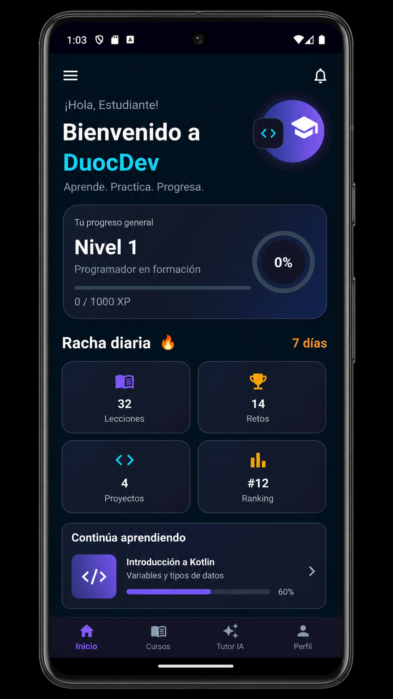
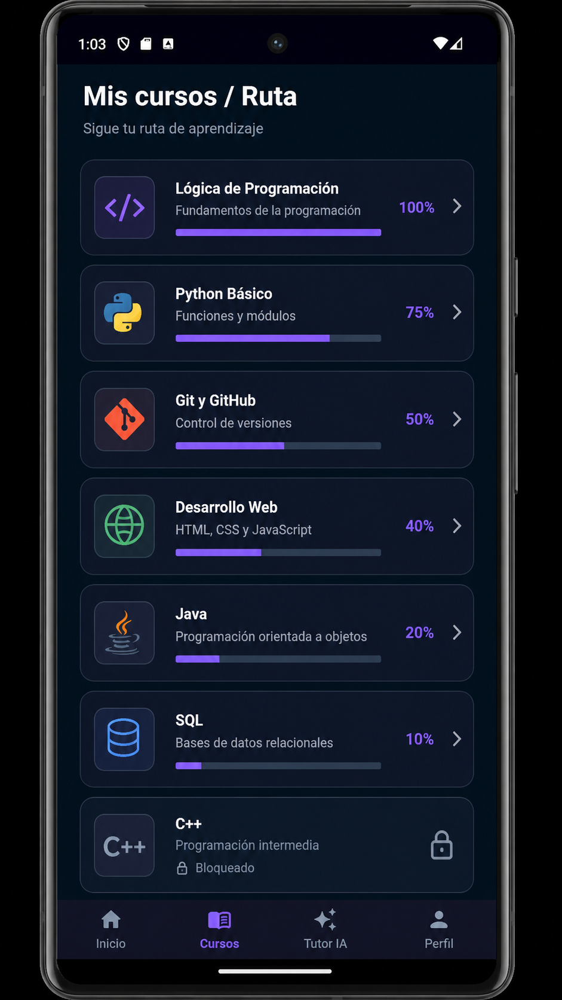
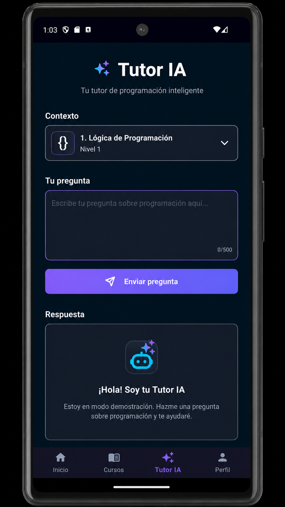
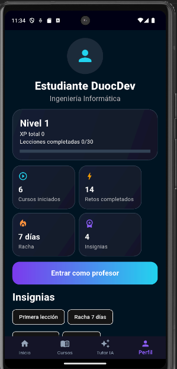

# DuocDev

**Plataforma educativa móvil para estudiantes de Ingeniería Informática de Duoc UC.**

DuocDev es un MVP educativo avanzado inspirado en ideas de SoloLearn, CoddyTech y Duolingo, pero con una propuesta propia: convertir material académico real en práctica personalizada revisada por profesor.

> Estado del proyecto: **MVP académico avanzado**. No es producción; falta revisión legal, seguridad, base de datos real y publicación.

## Propuesta diferencial

`Profesor sube material académico real → IA/demo genera ejercicios → profesor revisa y publica → estudiante practica contenido personalizado → DuocDev mide XP, racha, progreso y aprendizaje.`

DuocDev no busca ser una app genérica de cursos. El valor principal está en conectar la sala de clases con práctica móvil guiada.

## Capturas del proyecto

Las siguientes capturas muestran el estado actual del MVP de **DuocDev**, incluyendo la experiencia del estudiante, la ruta de aprendizaje, el Tutor IA y el perfil.

<br>

<table>
  <tr>
    <td align="center">
      <strong>Inicio</strong>
    </td>
    <td align="center">
      <strong>Cursos</strong>
    </td>
  </tr>
  <tr>
    <td align="center">
      
    </td>
    <td align="center">
      
    </td>
  </tr>
  <tr>
    <td align="center">
      <strong>Tutor IA</strong>
    </td>
    <td align="center">
      <strong>Perfil</strong>
    </td>
  </tr>
  <tr>
    <td align="center">
      
    </td>
    <td align="center">
      
    </td>
  </tr>
</table>

<br>

## Funcionalidades actuales

- Dashboard estudiante con nivel, XP, racha, meta diaria y continuidad de curso.
- Ruta de cursos: Lógica de Programación, Python Básico, Git y GitHub, Desarrollo Web, Java, SQL y C++ próximamente.
- Microlecciones con objetivo, explicación, ejemplo de código, tip docente y desafío.
- Desafíos con feedback inmediato, XP y resultado.
- Práctica inteligente con ejercicios publicados por profesor y fallback demo.
- Perfil con progreso, carrera, Duoc UC, insignias y acceso a modo profesor.
- Tutor IA contextual con modo demo/API seguro vía backend.
- Panel profesor con estado backend, métricas, materiales, banco de ejercicios y sincronización.
- Carga de material académico como texto.
- Generación de ejercicios desde material, aprobación y publicación.
- Backend Node.js/Express con persistencia JSON local.
- Modo offline/fallback y cola de sincronización docente.

## Modo estudiante

Flujo principal:

`Inicio → Cursos → Curso → Lección → Desafío → Resultado → Práctica inteligente → Perfil`

## Modo profesor

Flujo principal:

`Perfil → Entrar como profesor → Panel Profesor → Subir material → Generar ejercicios → Banco de ejercicios → Revisar/Aprobar/Publicar → Estudiante practica`

## Tutor IA

- Flutter no guarda ni expone claves.
- La app consulta `POST /ai/tutor` en el backend.
- Si no hay `OPENAI_API_KEY` o el backend falla, responde con fallback educativo demo.
- El tutor apoya el aprendizaje, pero no reemplaza la práctica ni la revisión docente.

## Backend MVP

Endpoints principales:

- `GET /health`
- `GET /materials`
- `POST /materials`
- `GET /materials/:id`
- `POST /materials/:id/generate-exercises`
- `GET /exercises`
- `POST /exercises/:id/approve`
- `POST /exercises/:id/publish`
- `GET /courses/:courseId/exercises`
- `GET /ai/info`
- `POST /ai/tutor`

## Tecnologías

- Flutter
- Dart
- Node.js
- Express
- JSON local para MVP
- OpenAI preparado solo desde backend

## Documentación

- [Estrategia de producto](docs/product_strategy.md)
- [Arquitectura](docs/arquitectura.md)
- [Integración backend](docs/backend_integration.md)
- [Modo offline y sincronización](docs/offline_sync.md)
- [Pendientes de producción](docs/pendientes_produccion.md)
- [Guía para agentes](AGENTS.md)

## Cómo ejecutar Flutter

```bash
flutter clean
flutter pub get
flutter run
```

Para Android Emulator con backend local:

```bash
flutter run --dart-define=BACKEND_BASE_URL=http://10.0.2.2:3000
```

## Cómo ejecutar backend

Windows:

```bash
cd backend
npm.cmd install
npm.cmd run dev
```

Linux/macOS:

```bash
cd backend
npm install
npm run dev
```

## Probar backend

```bash
curl http://localhost:3000/health
curl http://localhost:3000/materials
curl http://localhost:3000/exercises
```

Respuesta esperada de salud:

```json
{
  "ok": true,
  "service": "DuocDev Backend"
}
```

## Variables de entorno

Usar `backend/.env.example` como base:

```env
PORT=3000
OPENAI_API_KEY=
```

No se suben claves reales al repositorio.

## Roadmap

1. MVP Flutter + backend + IA demo.
2. Base de datos real.
3. Login y roles estudiante/profesor.
4. Subida de PDF/DOCX/PPTX y extracción de texto.
5. IA real con material indexado desde backend.
6. Panel web profesor.
7. Publicación móvil y operación segura.

## Autor

**Alfonso Guzmán**  
Estudiante de Ingeniería Informática - Duoc UC
